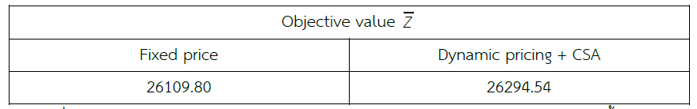
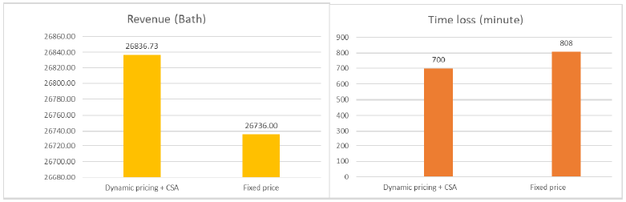

# Optimal Pricing and Seat Allocation in Thailand Railway Systems

## Project Overview

This project develops a dynamic pricing and seat allocation model for Thailand’s railway system using optimization techniques. The goal is to improve revenue and seat utilization under uncertain passenger demand by replacing traditional fixed pricing strategies with a data-driven approach.

---

## Problem Statement

Traditional railway pricing relies on static pricing strategies, which often lead to:

* Unsold seats during off-peak periods
* Overcrowding during peak demand
* Inefficient demand distribution across routes and time
* Revenue loss due to suboptimal pricing decisions

This project addresses these challenges by designing an optimization-based pricing model.

---

## Objectives

* Maximize total revenue
* Improve seat utilization across routes
* Balance passenger demand over different time periods
* Support data-driven decision-making for pricing strategies

---

## Data Description

The model is built on a multi-period Origin-Destination (OD) dataset, which captures:

* Passenger demand between station pairs (r, s)
* Multiple time periods (k)
* Travel patterns across the railway network

Data preprocessing steps included:

* Cleaning and validating OD data
* Handling missing and inconsistent values
* Structuring data for optimization modeling

---

## Methodology

The solution is based on a **Simulated Annealing (SA)** optimization approach.

Key components:

* Decision variables: Discount ratios for ticket pricing
* Objective function: Maximize revenue under capacity constraints
* Constraints: Seat capacity, demand limitations, service coverage

Why Simulated Annealing?

* Effective for complex, non-linear optimization problems
* Avoids getting trapped in local optima
* Suitable for large-scale combinatorial problems

---

## Results

The proposed model demonstrates clear improvements over the baseline (fixed pricing):

* **Demand increased by 30.775%**
* **Objective value improved from 26,109 → 26,294**
* **Seat utilization improved across multiple routes**
* **Computation speed improved by 30%** through parameter tuning

### Example Visualization



---

## Key Insights

* Ticket prices tend to increase closer to departure time
* High-demand routes naturally support higher pricing
* Dynamic pricing helps redistribute demand to underutilized routes
* The model balances revenue maximization with service accessibility

---

## Business Impact

This project demonstrates how optimization and data analytics can enhance revenue management in transportation systems.

Potential applications:

* Railway systems
* Airlines and logistics
* Public transportation planning

By adopting dynamic pricing strategies, organizations can:

* Increase operational efficiency
* Improve resource utilization
* Make more informed, data-driven decisions

---

## Tech Stack

* Python
* Simulated Annealing
* Data Processing & Optimization Techniques

---

## Project Structure

```
/data          # Sample dataset
/notebooks     # Data processing and modeling workflow
/src           # Core optimization code
/images        # Visualizations used in README
/docs          # Full presentation
/README.md     # Project documentation
```


## 👩‍💻 Author

Athidtayaporn Jindawong

---

## ⭐ Notes

This project was developed as part of an academic study and has been refined for portfolio presentation to highlight both technical and business impact.
